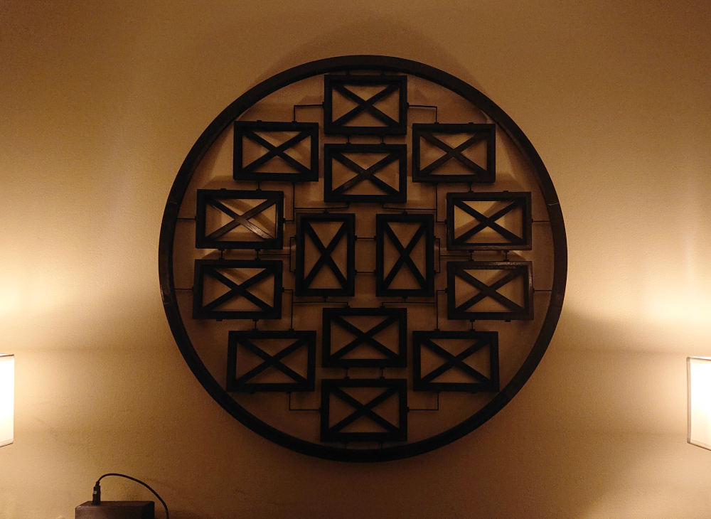
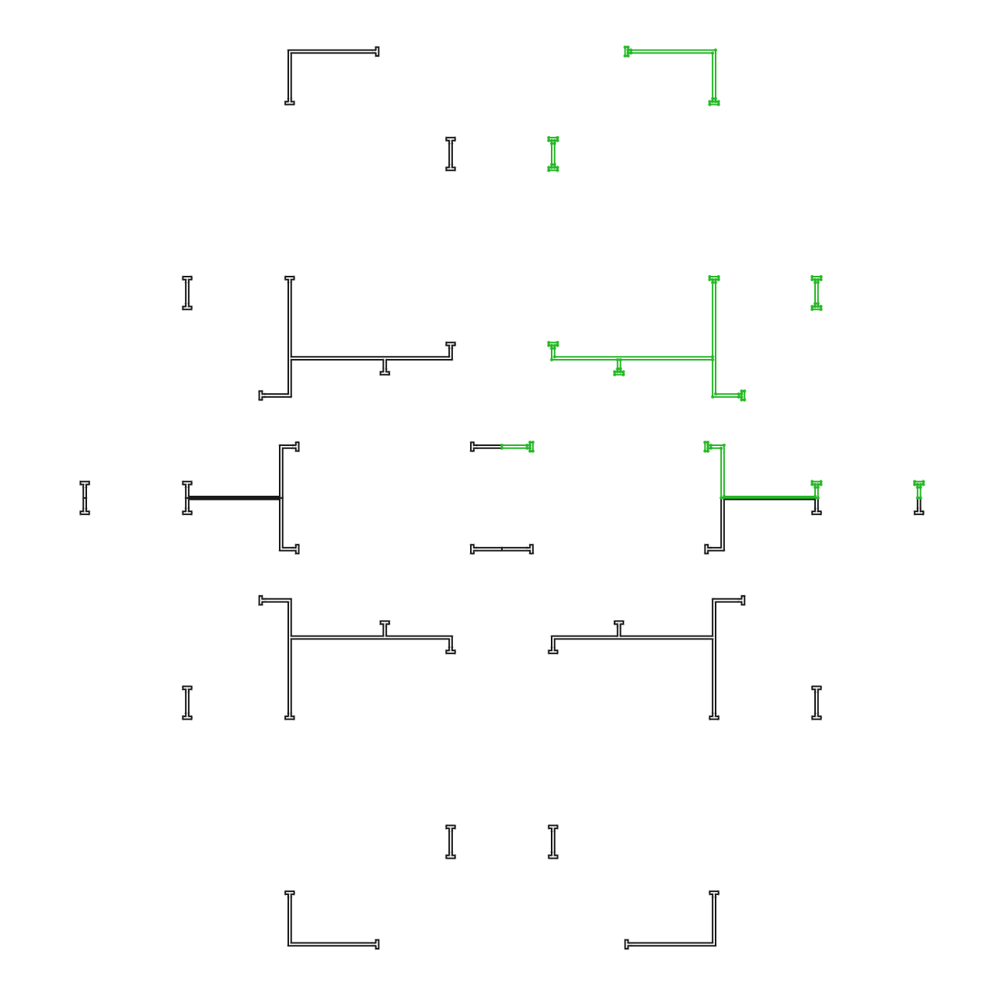
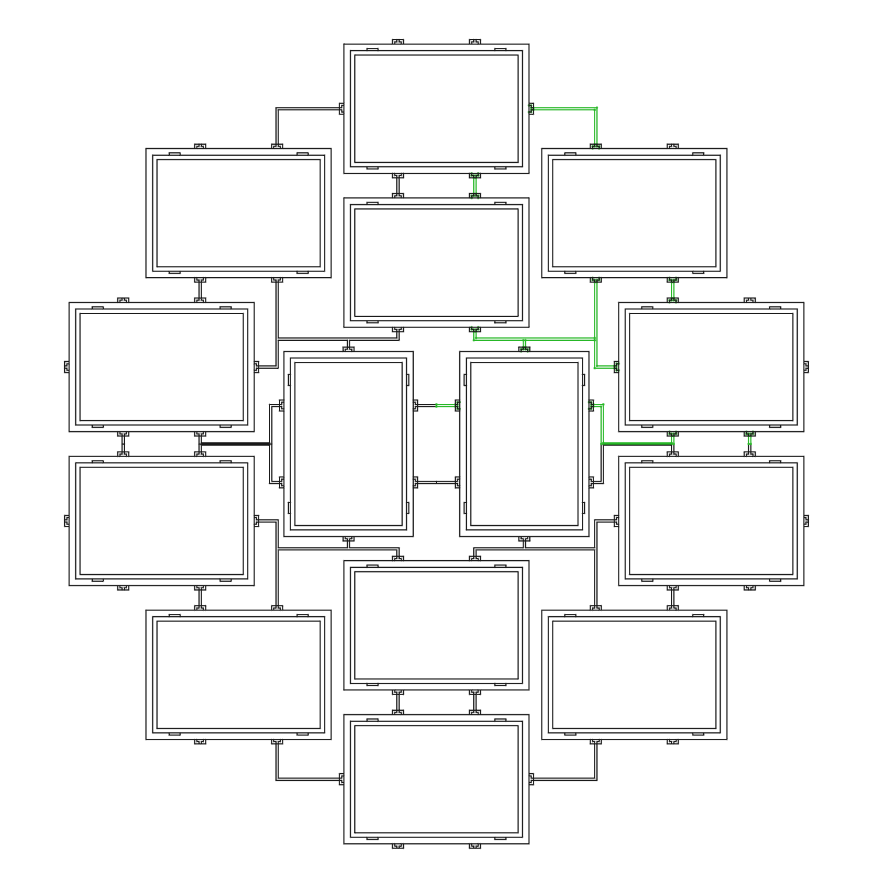
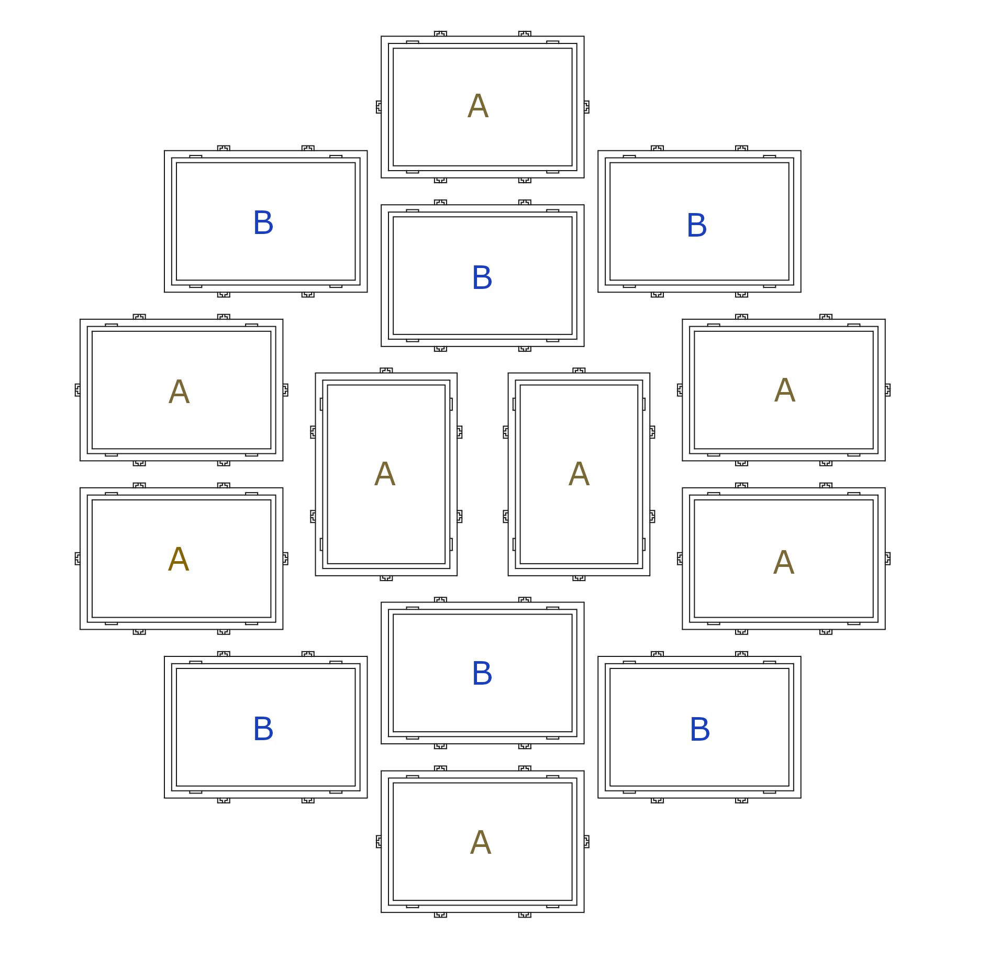
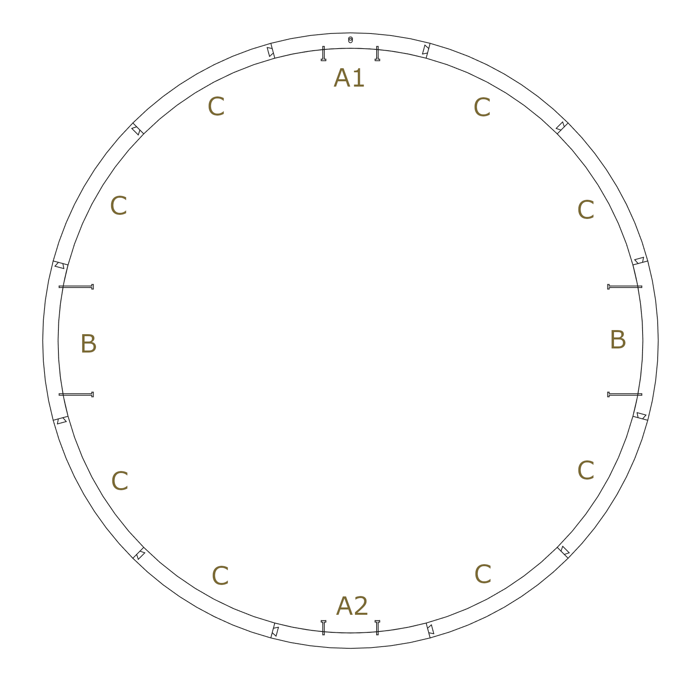

# Radial Photo Frame (v1)

## Overview

This is a lightweight frame that holds exactly 14 4x6" photographs.

It's not perfect (some sagging) but overall it looks great.

## Instructions

This 3d print uses a substantial amount of interconnected parts, so take extra care to make sure your print bed, extruder, belts,
and filament are correctly calibrated first. It was also my first large-scale project, so tolerances aren't 100% tuned in yet.

> **Print at your own risk (of filament)!** A better (fully parametric) version of this frame is coming.

- .2mm layer height is recommended for this project
- thicker walls will produce better connectors.
- 10-15% infill for all parts except connectors
- 100% infill for connectors

For the frame pieces, I recommend using additional top layers in case you don't enjoy the 3d-print look caused by thin layers/bridging.

I've included some diagrams to explain the layout of various pieces, but essential you'd be printing:

- `frame-a.stl` - 8 prints
- `frame-b.stl` - 6 prints
- `orbit-a1.stl1` - 1 print
- `orbit-a2.stl` - 1 print
- `orbit-b.stl` - 2 prints
- `orbit-c.stl` - 8 prints
- `connectors.stl` - 2 prints
- `backplate.stl` - 14 prints

## Diagrams

### Connectors

### Frame layout

### Orbit layout

## Additional notes
Based on the MK3S build plate, it's recommended that you print one piece at a time. Printing one frame, and the connectors
first will help diagnose if your printing tolerances are up to snuff, or if you need additional tuning or tweaks in your slicer.
If this is the case, changing your slicing settings should yield better results (i.e XY Size Compensation).

## Lore
I wanted a wall multi-picture frame, but the ones I kept seeing were made for 6 pictures. Felt obligated to put my newly learned CAD
practicing to work.

## License
This work is licensed under a
[Creative Commons Attribution-ShareAlike 4.0 International License][cc-by-sa].

[![CC BY-SA 4.0][cc-by-sa-image]][cc-by-sa]

[cc-by-sa]: http://creativecommons.org/licenses/by-sa/4.0/
[cc-by-sa-image]: https://licensebuttons.net/l/by-sa/4.0/88x31.png
[cc-by-sa-shield]: https://img.shields.io/badge/License-CC%20BY--SA%204.0-lightgrey.svg