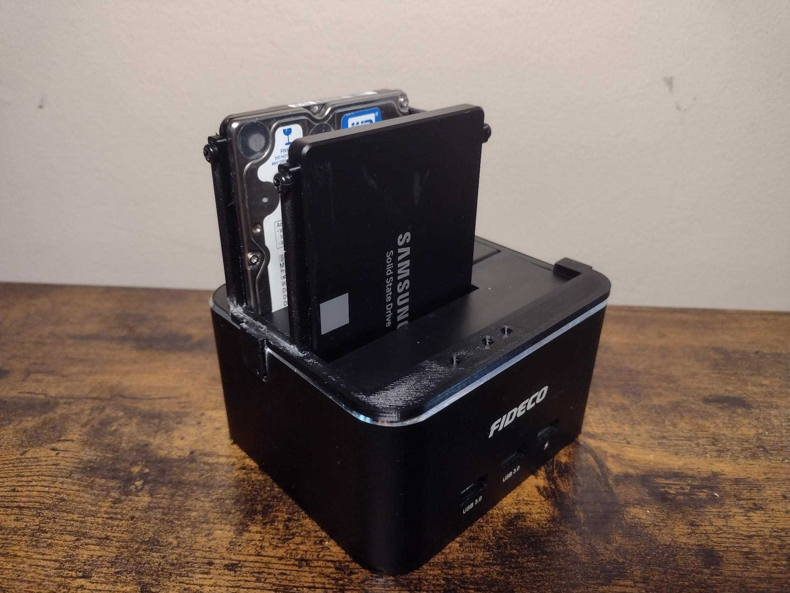

# Fideco Drive Fixture

## Overview

A printable 2.5 drive mounting mod for the [Fideco Drive Bay - ‎Y842HB-JP](https://www.amazon.ca/gp/product/B07GZLKQSN?th=1).

Helps for when you don't plan on removing drives for a considerable amount of time.

## Printing Instructions

- 60% Infill is recommended for a decent amount of strength and load resistance.
- .2mm layer height recommended.
- Make sure your build plate is clean - otherwise, you will need to use adhesive or brim.
- This print has small parts with edges, so a draft shield - or printing in a stable environment is ideal.

I've included a `.3mf` file with most of these settings already applied (except brim).

### Assembly

- Take extra care to make sure the LED cut-outs align correctly with the LEDs on the surface. The two tabs on the left and
right side of the mount should be superglued to the body of the enclosure. Extraneous glue can be added between the body mount
and the top of the drive bay for extra security.

- Carefully glue the "U" shaped bracket to the left side of the mount, making sure it's aligned with the drive ports, and also
flush with the body mount. If this is confusing, please see the FreeCAD file or image for inspiration.

- Use 4 x M3 screws to secure the drives to the brackets. The ones used for my make have a 4mm usable depth.

## Parametric

I've included a parametric FreeCAD file for this mount mod, which has a LOT of settings that can be changed.

The most notable parameters included are `port_mount_height` which will increase the height of the "U" shaped bracket
to help incorporate larger drives, and `port_hole_distance_vert` which will raise or lower the center of the mounting
hole for said bracket (on both sides).

I would have included a mount for larger drives, but unfortunately I don't own any. If you or someone you loves has a big
chunky boi that can be measured, feel free to remix this - or include the altered file in a PR here.

## Lore

I have a low power-NAS at home that I wanted to upgrade with solid state caching. Thankfully I already owned
this hot-swapping drive bay that served me for the projects I needed it for.

The device itself is really well performant when solely used as a drive bay and an occasional USB reader. The one thing that needed
to be dealt with was preventing mechanical failures at the connector-level, as well as help discourage "yoinking" where
someone could literally just pluck my NAS drive and call it a day.

Also, there's literally a "kill all my data" button on the top of the device that is raised enough to be pressed easily. I have
still redundant backups, but accidentally clicking this button would still be a great way to ruin my day. The body mount includes
a small pocket to surround the "kill all my data" button, so at least someone would need to really attack it in order to cause it to trigger.

> It's actually a drive cloning button, but "kill all my data" better reflects what would happen if I used it.

## License
This work is licensed under a
[Creative Commons Attribution-ShareAlike 4.0 International License][cc-by-sa].

[![CC BY-SA 4.0][cc-by-sa-image]][cc-by-sa]

[cc-by-sa]: http://creativecommons.org/licenses/by-sa/4.0/
[cc-by-sa-image]: https://licensebuttons.net/l/by-sa/4.0/88x31.png
[cc-by-sa-shield]: https://img.shields.io/badge/License-CC%20BY--SA%204.0-lightgrey.svg