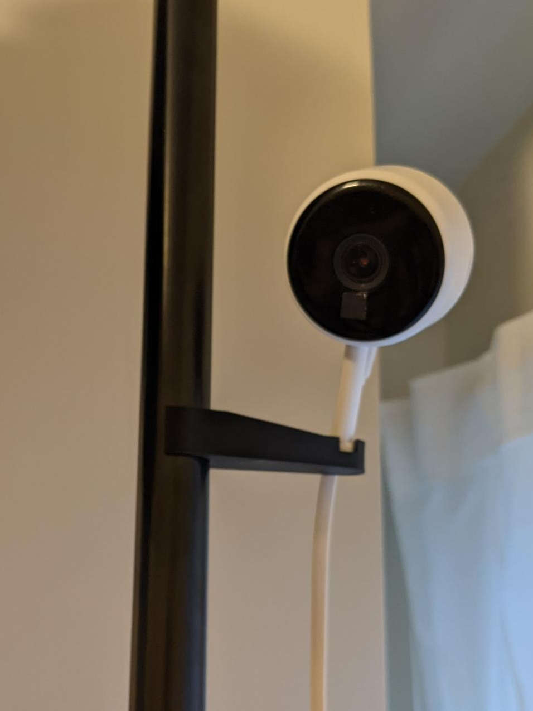

# Orbital Camera Mount (parametric)

## Overview

Attach your orbital cameras to a non-flat surface. Easily modified with parameters.

## Instructions

The default configuration is intended for the **Littlelf LF-C1t**, but the parameters described below can be used to configure for other orbit-based cameras.

### Parametric

The default `littlelf_mount.stl` file has an extension length of roughly 60mm from camera to rod. I've included
the FreeCAD file for this utensil holder, which can be adjusted to increase clip dimensions, extension size, clip-sizing,
clip angle, and the size of the ball-joint attachment.

Here's some of the more notable parameters you can change, though there are lots!

- `camera_joint_diam` - the diameter of the ball-joint orbit (mm)
- `rod_joint_diam` - the diameter of the rod attachment (mm)
- `distance` - the distance between the rod attachment and the ball-joint orbit (mm)
- `padding` - the thickness of most surfaces (mm)
- `rod_joint_height` - the vertical height of the joining point of the rod attachment (mm)
- `camera_join_height` - the vertical height of the joining base for the ball-joint orbit (mm)
- `camera_join_slot` - the width of the slot cut for the ball-joint orbit (mm)
- `camera_join_slot_depth` - the depth of the slot cut for the ball-joint orbit (mm)
- `camera_join_cut_angle` - the angle used to determine how much of the rod should be cut for snap-on effect (deg)

## Lore

The OEM Littlelf camera mount does not fair well when trying to attach it to non-flat surfaces, such as a clothes rod or corner.
This model allows the ball-joint attachment of the camera and a non-flat surface to attach to each-other.

## License

This work is licensed under a
[Creative Commons Attribution-ShareAlike 4.0 International License][cc-by-sa].

[![CC BY-SA 4.0][cc-by-sa-image]][cc-by-sa]

[cc-by-sa]: http://creativecommons.org/licenses/by-sa/4.0/
[cc-by-sa-image]: https://licensebuttons.net/l/by-sa/4.0/88x31.png
[cc-by-sa-shield]: https://img.shields.io/badge/License-CC%20BY--SA%204.0-lightgrey.svg
