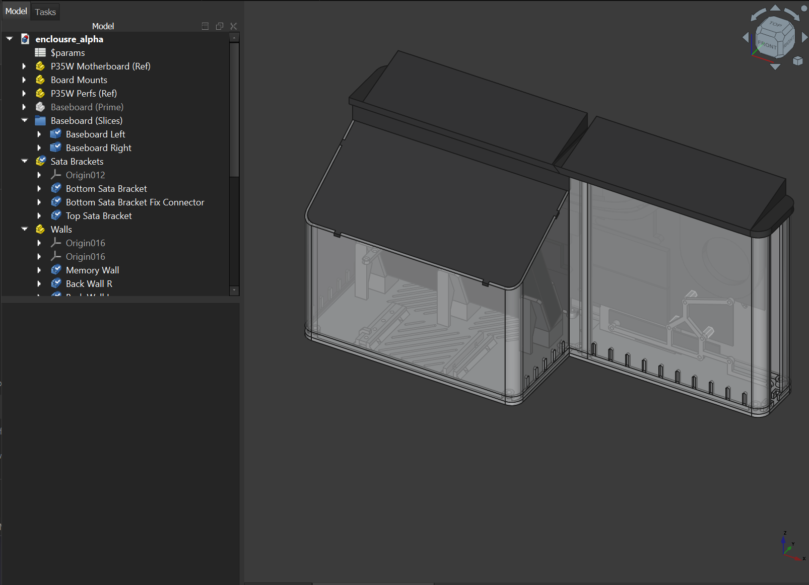
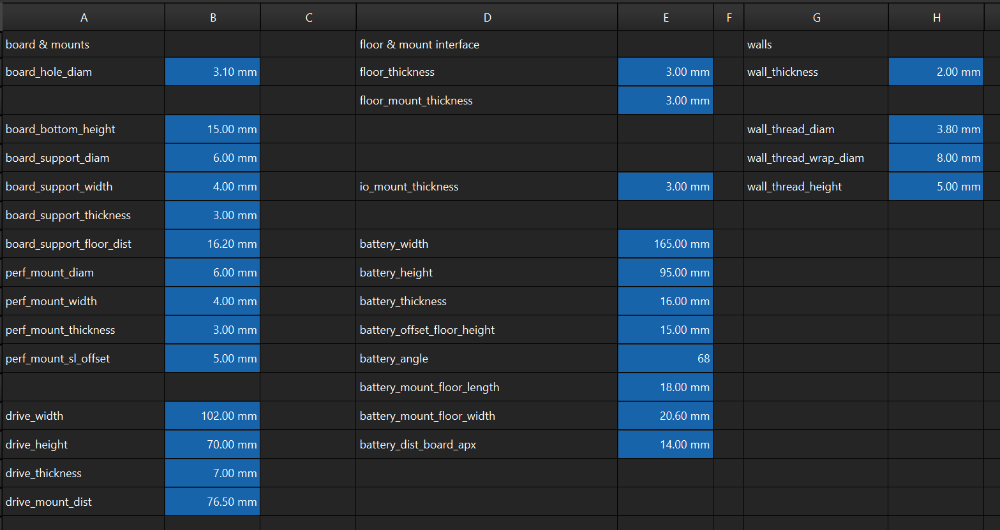
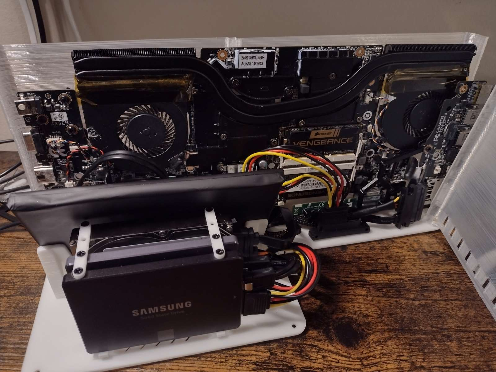

# Enclosure Alpha P35W (Deprecated)

> This model is mostly an exercise in modular design and reverse engineering. It will work if you own the exact motherboard needed (which is likely less than 100 people at this point).

## Overview

Project Enclosure Alpha was one of my first fully fledged reverse engineering exercises, where I set out to create a heat-safe enclosure for my Gigabyte P35W laptop motherboard. It was an experiment in modular design patterns in CAD. It's marked as deprecated due to it being experimental, and how old the motherboard is - it's likely not usable in it's current form.

## Instructions

Enclosure alpha was designed to only need PLA for the majority of the parts, as heat would be pushed upwards. This assumes some clearance at the bottom of the unit to enable venting of cooler air from the bottom, naturally forcing expulsion of the hot air being expelled by the cooling solution of the P35W motherboard.

The top pieces of enclosure alpha are intended to be printed in either PETG or ABS, as they are handling the heat load from the motherboard.

### Parametric

This one is mostly parametric. Reverse engineering meant that I had to sometimes account for variables that might be interdependent, or change in the middle of the process. These parameters are numerous however, and listing them exhaustively for a deprecated model would be rather tedious. Here's a screenshot of the controllable values.

## Lore

When starting on my self-hosting/homelab journey - I noticed overhead having to deal with the flakey power at the condo I was living in at the time. Instead of investing 500+ for a UPS that could handle the load of a full server, I reutilized the power saving mechanisms of an older gaming laptop that outlived it's original purpose.

The original case of the laptop was pretty roughed up, and I wanted to have more than one drive connected to the motherboard. After finding some motherboard cards that could add several SATA3 ports - I knew I was on to something.

Enclosure Alpha served me for over a year and a half.

## License

This work is licensed under a
[Creative Commons Attribution-ShareAlike 4.0 International License][cc-by-sa].

[![CC BY-SA 4.0][cc-by-sa-image]][cc-by-sa]

[cc-by-sa]: http://creativecommons.org/licenses/by-sa/4.0/
[cc-by-sa-image]: https://licensebuttons.net/l/by-sa/4.0/88x31.png
[cc-by-sa-shield]: https://img.shields.io/badge/License-CC%20BY--SA%204.0-lightgrey.svg
