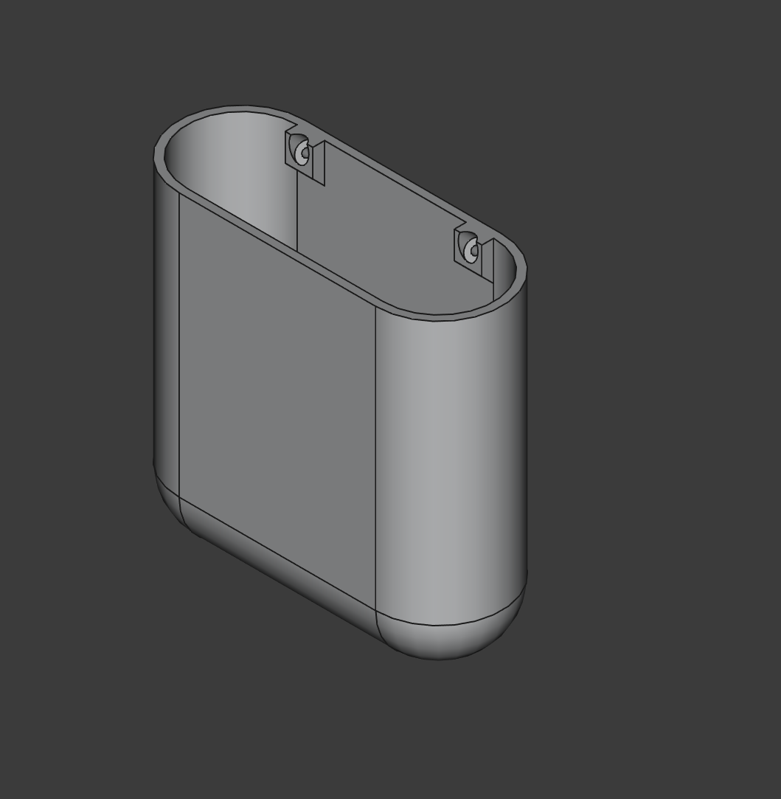

# Bathroom Wall Holder

## Overview

A makeshift wall-based toiletry holder. Fully parametric.

## Instructions

This should only be printed in PETG or in a different hydrophobic material. Unlike some of my other designs, this one might need to be replaced every 2-3 years (depending on how good you are at rinsing your toothbrush).

Depending on your slicer, inset text can be added to the front of the model (as I have done many times)

### Parametric

The default sizing can be modified to fit several use cases (including non bathroom ones). Some of the more notable ones are included below:

- `width` - The external width of the holder (mm)
- `depth` - The external depth of the holder (mm)
- `height` - The external height of the holder (mm)
- `drain_width` - The width of each drain (mm)
- `drain_count` - The number of drains spanning the entire width (count)
- `nail_head_diam` - The diameters of the nail inset (mm)
- `nail_diam` - The clearance diameter of the nail hole (mm)
- `nail_count`- The total number of nails spanning the entire width (count)

## Lore

I wanted to make tooth-brushing more personable for my little ones. Having a dedicated place for them to stow their toilitries in our very small bathroom was very helpful!

## License

This work is licensed under a
[Creative Commons Attribution-ShareAlike 4.0 International License][cc-by-sa].

[![CC BY-SA 4.0][cc-by-sa-image]][cc-by-sa]

[cc-by-sa]: http://creativecommons.org/licenses/by-sa/4.0/
[cc-by-sa-image]: https://licensebuttons.net/l/by-sa/4.0/88x31.png
[cc-by-sa-shield]: https://img.shields.io/badge/License-CC%20BY--SA%204.0-lightgrey.svg
