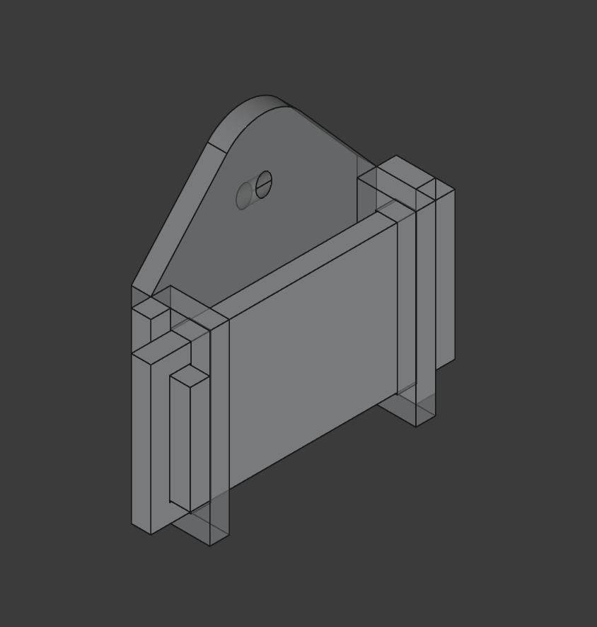

# Wall Mount Holder

## Overview

Simply load bearing wall mount for things that require looped hooks. Adjustable size via FreeCAD.

## Instructions

Print in any filament, but PLA seems to be best for this specific model. Each part can be printed in an assembly.

### Parametric

The default hook can be modified to enable some additional sizes.

- `hook_width` - The width of the internal hook area (mm)
- `hook_length` - The length of the internal hook area (mm)
- `padding` - The thickness of every wall (mm)

## Lore

My mother made a gift for me that required me to have a load bearing mount that allowed loops. This was the end result of that.

## License

This work is licensed under a
[Creative Commons Attribution-ShareAlike 4.0 International License][cc-by-sa].

[![CC BY-SA 4.0][cc-by-sa-image]][cc-by-sa]

[cc-by-sa]: http://creativecommons.org/licenses/by-sa/4.0/
[cc-by-sa-image]: https://licensebuttons.net/l/by-sa/4.0/88x31.png
[cc-by-sa-shield]: https://img.shields.io/badge/License-CC%20BY--SA%204.0-lightgrey.svg
