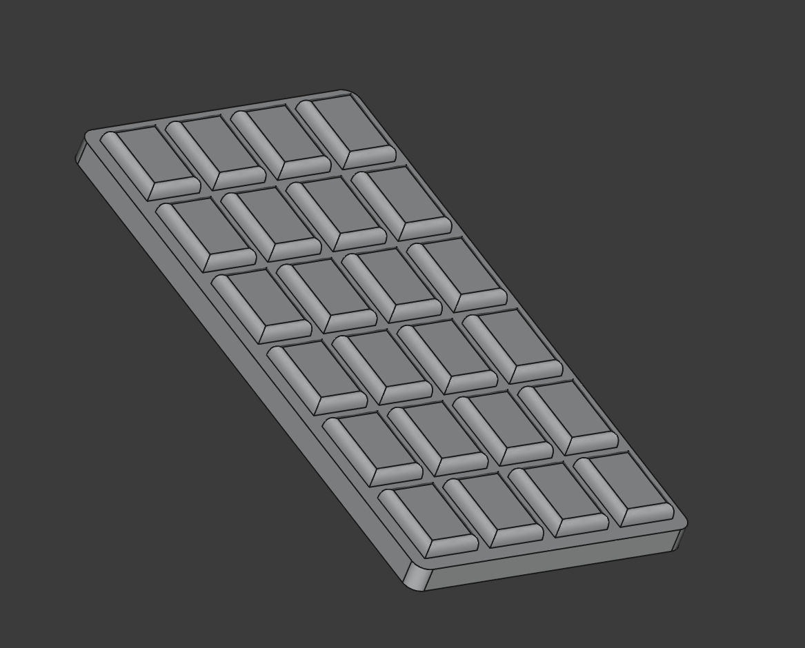

# Parametric Chocolate Bar (Toy)

## Overview

A modern 3D printable "chocolate bar," a special request from one of my kids.

## Instructions

Thicker walls will hold up better to more mechanical wear (like, exposure to a child). Print the bottom of the bar against the build plate.

### Parameters

The chocolate bar adjusts it's internal spacing dimensions based on the provided width and height, and the piece counts (in the X and Y axis, relative to length and width).

- `width` - The width of the bar (mm)
- `length` - The length of the bar (mm)
- `depth` - The thickness of the base of the bar (mm)
- `offset_sides` - The margin gap between the chocolate bar and it's top extrusions (mm)
- `gap_depth` - The distance between each inner extrusion (mm)
- `gap_rounding_dist` - How rounded each piece will be (mm)
- `gap_distance` - The distance between each gap from one-another (mm)
- `inset_depth` - How tall each extrusion is meant to be (mm)
- `pieces_y` - Number of extrusions (pips) along the length of the bar (count)
- `pieces_x` - Number of extrusions (pips) along the width of the bar (count)

## Lore

For a while, I dabbled in a reward currency system with my two little ones. At the end of each week, my children would be able to ask for a toy had they saved enough coins - and one of those weeks, my eldest daughter asked me for a "chocolate bar toy for the kitchen." This is what came out of it.

Unfortunately, the currency ultimately collapsed and the government had to "switch gears" to different forms of negotiations.
