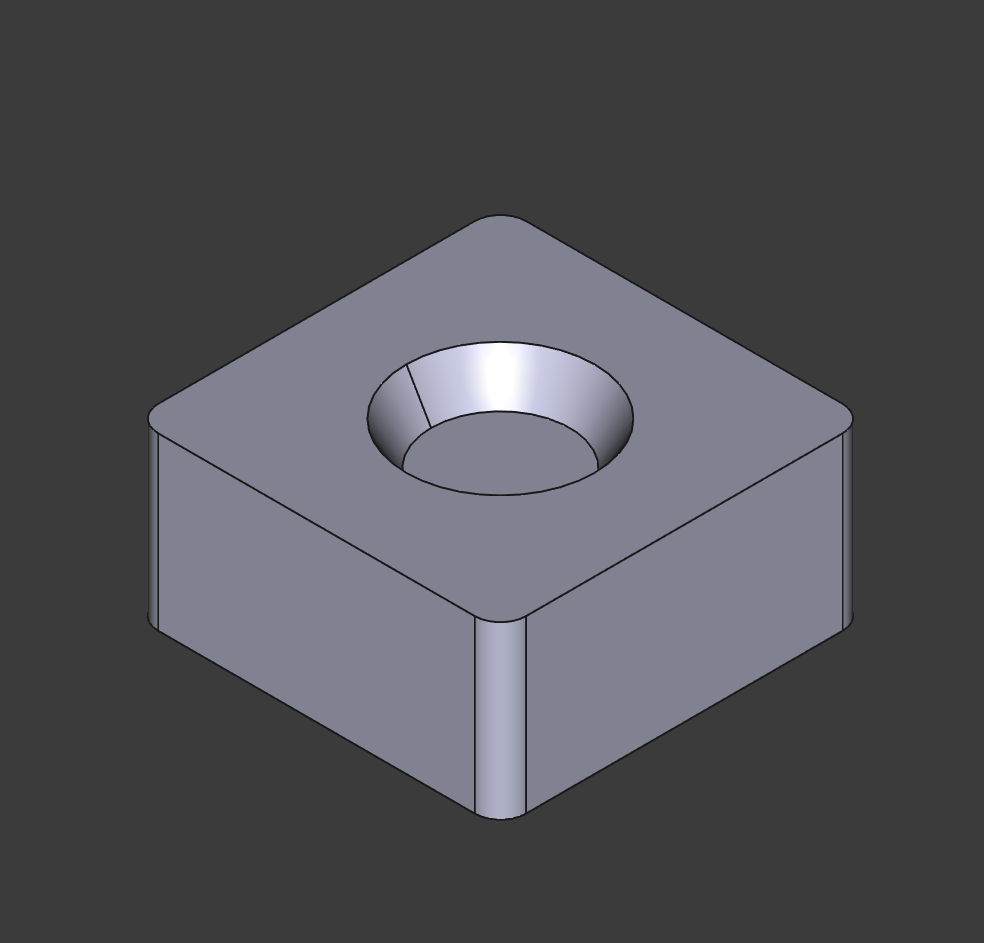

# Parametric Furniture riser

## Overview

Old floors? Tall furniture? Use these to help raise existing pieces off the floor by exact heights. Designed for load bearing.

## Instructions

For this model to be most beneficial, it's good to know:

- What kind of furniture needs to be raised
- The exact heights that need to be corrected
- The size of the feet of existing furniture
- The height of any dampers you will place beneath the riser

For this reason, it's recommended that you use the FreeCAD file to modify the dimensions for your own use cases.

Best printed with the bottom of the riser against the build plate, and tested in PLA.

### Parameters

Here are the parameters than can be modified to fit most use cases.

- `width` - The width of the riser (mm)
- `length` - The height of the riser (mm)
- `depth` - The depth of the riser - not including any damper feet (mm)
- `foot_inset_depth` - The depth of the original furniture foot (if not applicable - set to 0) (mm)
- `foot_inset_diam` - The diameter of the original furniture foot (mm)
- `foot_inset_chamfer` - The chamfer/filter of the original furniture foot (mm)

## Lore

My old rental had huge random dips in the floor, which meant that certain cabinets or other furniture pieces would appear slanted against the wall (when compared to the trim). This also meant that gravity was often making these pieces unsturdy, or making it harder to operate doors. This pieces solved that issue indefinitely.

## License

This work is licensed under a
[Creative Commons Attribution-ShareAlike 4.0 International License][cc-by-sa].

[![CC BY-SA 4.0][cc-by-sa-image]][cc-by-sa]

[cc-by-sa]: http://creativecommons.org/licenses/by-sa/4.0/
[cc-by-sa-image]: https://licensebuttons.net/l/by-sa/4.0/88x31.png
[cc-by-sa-shield]: https://img.shields.io/badge/License-CC%20BY--SA%204.0-lightgrey.svg
