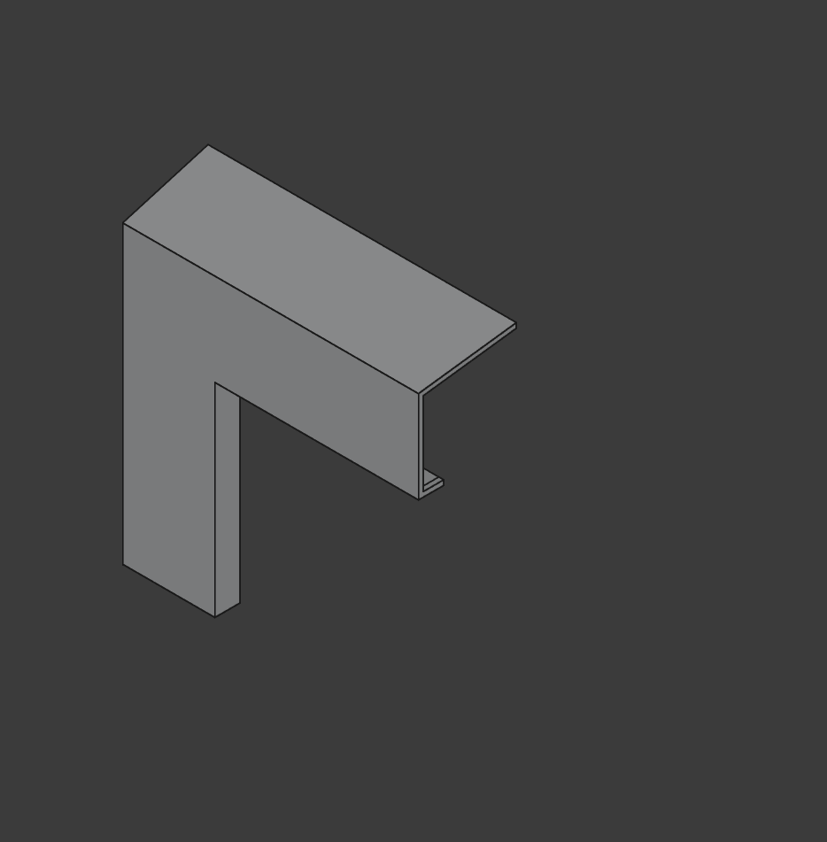

# Samsung Monitor Deco Plate (deprecated)

> I no longer use these monitors, so the deco-plate project didn't fully finish. Ended up doing a much needed upgrade to a monitor that worked better for my needs. It also requires a large form factor printer to get the most benefit from the design.

## Overview

A decorative plat that fits MANY Samsung 4K monitors, based on the weird angles presented by it's ridges. Samsung monitors seem to rely heavily on the same design patterns.

## Instruction

Best printed with the front-face of the modal against the build plate. IT's best to know the exact measurements of the monitor before you attempt to print deco pieces, and to start with the corners.

### Parameters

- `tol` - Added tolerance dimen (mm)
- `thickness` - The thickness of every wall (mm)
- `angle` - The angle of the samsung monitor (deg)
- `width` - The extruded width of the deco plate in the X axis (mm)
- `height` - The extruded height of the deco plate in the Y axis (mm)
- `screen_depth` - The depth of the samsung monitor frame (including the angle) (mm)
- `screen_lcd_offset` - The offset of the LCD screen and the outer edge of the frame (mm)
- `screen_frame_thickness` - The distance between the LCD panel and the front of the frame (mm)

## Lore

I wanted to make my Samsung 4K monitor blend a little better with my retro setup (I use a Commodore 1702 at my desk alongside my primary display), and this project was a means to do that. Before I decided to finish this project however, my monitor kept flaking out in weird ways thanks to awful CEC compliance (the Samsung one, not the 1702).

## License

This work is licensed under a
[Creative Commons Attribution-ShareAlike 4.0 International License][cc-by-sa].

[![CC BY-SA 4.0][cc-by-sa-image]][cc-by-sa]

[cc-by-sa]: http://creativecommons.org/licenses/by-sa/4.0/
[cc-by-sa-image]: https://licensebuttons.net/l/by-sa/4.0/88x31.png
[cc-by-sa-shield]: https://img.shields.io/badge/License-CC%20BY--SA%204.0-lightgrey.svg
