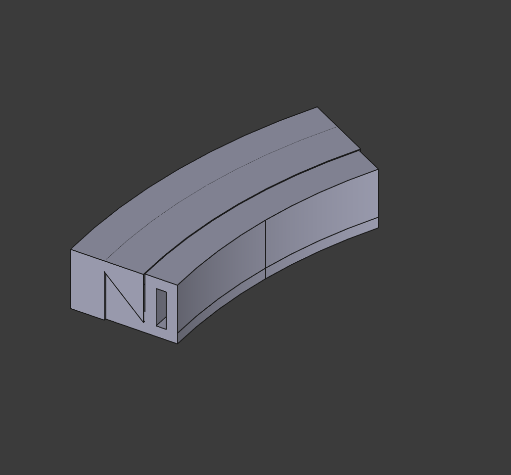

# Experimental chair attachment cleat

## Overview

A starting point for mounting things to an office chair, without having said thing stay permanently. Uses large zip ties.

## Instructions

Print with the flat faces on the build plate (the slanted faces are expected to be printed upwards). This cleat design is very experimental, and from the initial tests that I did - modifying the angle depending on your needs is ideal. Ideally, you'd use your slicer to modify the `ExtMount` model to accommodate whatever fixtures you need.

Works best in PLA due to it's frictional properties.

### Parameters

I've never made an arc-ed cleat before, so I did what I could to make sure my prototypes were iterable. Here's what can be configured:

- `mount_width` - The inner distance of the cleat's inner most arc - which would be the chair (mm)
- `mount_thickness` - The wall thickness of the cleat (mm)
- `mount_cleat_size` - The inner distance of the cleat joint itself (mm)
- `mount_tie_cut_width` - The zip-tie space needed to accommodate thickness (mm)
- `mount_tie_cut_height` - The zip-tie space needed to accommodate height (mm)
- `mount_base_rad_distance` - The internal arc distance, affecting how curved the cleat is (best to leave this alone) (mm)
- `mount_ext_width` - The outer width of the cleat that will rest on the inner cleat (mm)
- `mount_ext_thickness` - The thickness of the cleat that will rest on the inner cleat (mm)

## Lore

For my work setup, I started experimenting with a greenscreen. In order to accommodate better lighting, I utilized the space I had to ensure I could attach lights to the back of the chair. This project came from that.

## License

This work is licensed under a
[Creative Commons Attribution-ShareAlike 4.0 International License][cc-by-sa].

[![CC BY-SA 4.0][cc-by-sa-image]][cc-by-sa]

[cc-by-sa]: http://creativecommons.org/licenses/by-sa/4.0/
[cc-by-sa-image]: https://licensebuttons.net/l/by-sa/4.0/88x31.png
[cc-by-sa-shield]: https://img.shields.io/badge/License-CC%20BY--SA%204.0-lightgrey.svg
