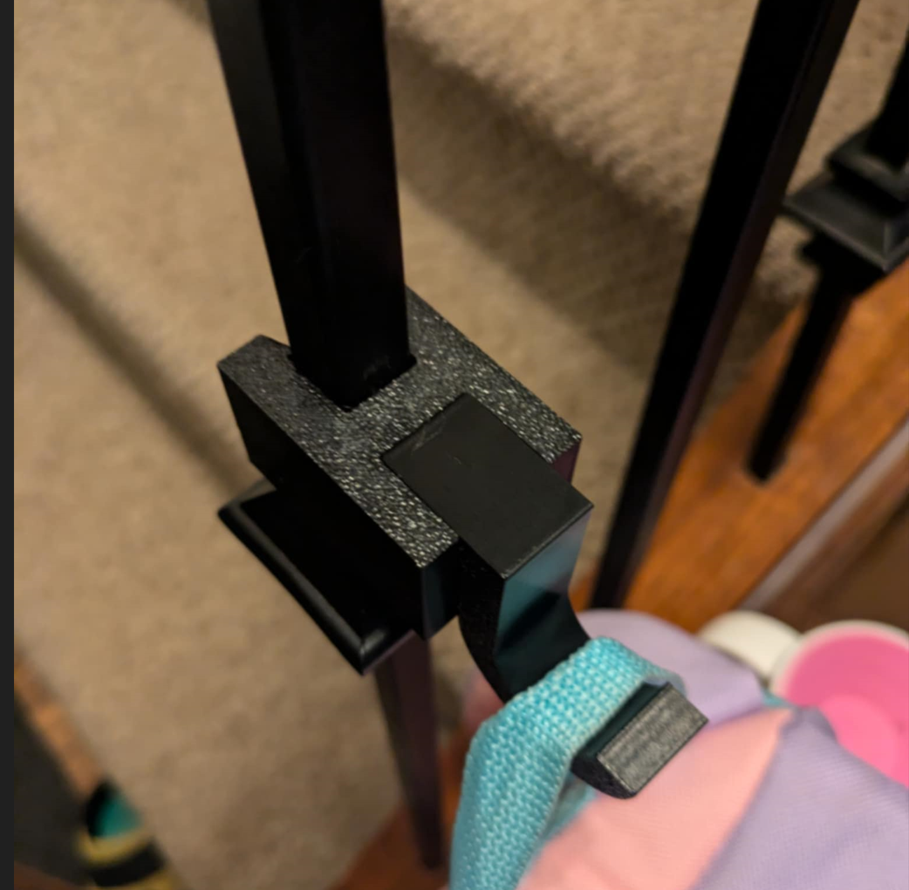

# Parametric Banister Hook v1

## Overview

Adds hooks to where hooks have not gone before. Fully parametric and extremely load bearing. Only intended for square banisters.

## Instructions

The hook portion of this model MUST be printed on it's side to ensure load bearing. Printing it any other way will mean loads will shear the part completely.

It's recommended to print this in PETG for better layer adhesion. The hook only inserts once into the banister hook. Thicker walls are better.

### Parameters

This model relies heavily on it's snap-fit, so changing the dimensions to match not just the banister size, but also the specs of your printer would be ideal. `tol` may be the more important param in that regard, while other's will fit your own use case:

- `tol` - The tolerance between snap-fit parts (might need to be tweaked for your printer) (mm)
- `thickness` - The wall thickness for each hook (mm)
- `b_width` - The banister width (mm)
- `b_length` - The banister length (mm)
- `clip_gap` - The distance between each nib of the the banister clip, should be slightly less than the banister width (mm)
- `clip_depth` - How deep each lip is of the banister (mm)
- `hook_radius` - The radius of the hook part extrusion (mm)
- `hook_width` - The holding width of the hook part (mm)
- `hook_thickness` - How thick the hook part is (mm)
- `body_depth` - How deep the main body (non hook) should be (mm)
- `hook_angle` - How far the hook will curve around (deg)

## Lore

We recently moved and needed more accessible space to hang my children's backpacks and coats. Instead of mounting anything, I decided to utilize the very study steel banisters instead.

## License

This work is licensed under a
[Creative Commons Attribution-ShareAlike 4.0 International License][cc-by-sa].

[![CC BY-SA 4.0][cc-by-sa-image]][cc-by-sa]

[cc-by-sa]: http://creativecommons.org/licenses/by-sa/4.0/
[cc-by-sa-image]: https://licensebuttons.net/l/by-sa/4.0/88x31.png
[cc-by-sa-shield]: https://img.shields.io/badge/License-CC%20BY--SA%204.0-lightgrey.svg
