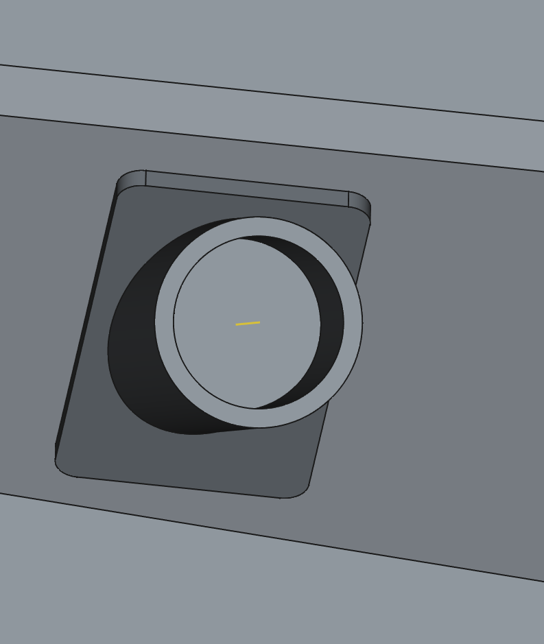
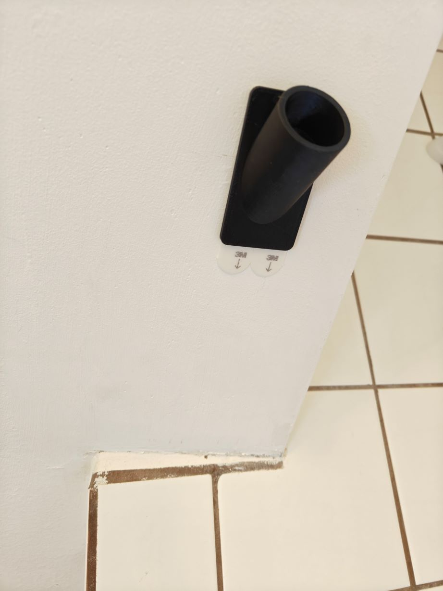

# Parametric slanted shower rod mount

## Overview

Mount your shower-rod in slanted bathrooms using this one neat trick. No screws needed!

## Instructions

This print requires two large 3M Command strips, and is best printed in a hydrophobic material like PETG or ABS. I had great success with PETG.

# Parameters

This print will require you to use FreeCAD to enter in the following information:

- The diameter of your shower rod
- The slant of your wall (in the x axis) in degrees
- The slant of your wall (in the y axis) in degrees

In my case, my bathroom had a wall slant in both axis, which is represented here. You can modify the following parameters to meet your own needs:

- `angle_x` - The slant angle of the wall in the X axis (if your wall is slanted in one direction, set this to 0) (deg)
- `angle_y` - The slant angle of the wall in the Y axis (this is a normal slant) (deg)
- `base_width` - How wide the base should be (currently for two large command strips) (mm)
- `base_height` - How tall the base should be (currently for two large command strips) (mm)
- `diam` - The diameter of the shower rod (mm)
- `thickness` - The wall thickness (mm)
- `ext_depth` - How far the shower rod holder extrusion should be (mm)
- `ext_cut_depth` - How far the shower rod holder inner cut should be (mm)

## Lore

After moving to a much nicer (but older) home, the shower exists beneath partially slanted ceiling (with a skew in both X and Y). This meant that the shower rod was mounted uncomfortably low, and I wasn't going to have that. This model was a response to that - and was also a deeper dive into FreeCAD datums.

## License

This work is licensed under a
[Creative Commons Attribution-ShareAlike 4.0 International License][cc-by-sa].

[![CC BY-SA 4.0][cc-by-sa-image]][cc-by-sa]

[cc-by-sa]: http://creativecommons.org/licenses/by-sa/4.0/
[cc-by-sa-image]: https://licensebuttons.net/l/by-sa/4.0/88x31.png
[cc-by-sa-shield]: https://img.shields.io/badge/License-CC%20BY--SA%204.0-lightgrey.svg
