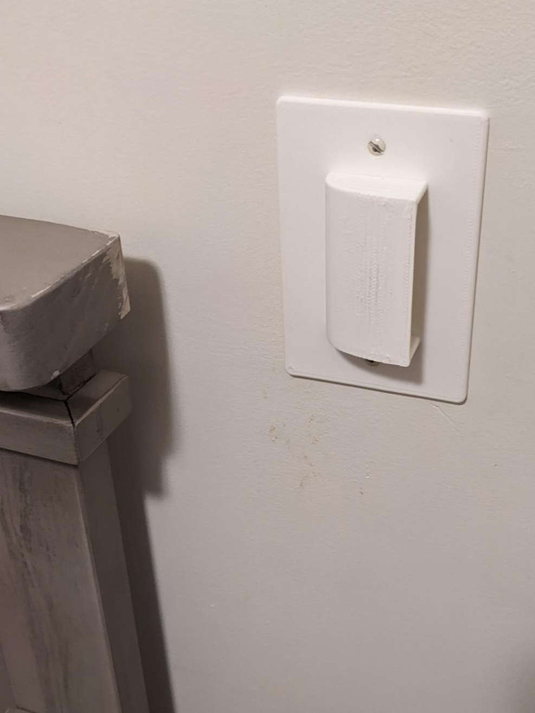

# Baby-safe light-switch cover (Decora)

## Overview

Is your light-switch also really close to a toddler crib? Deter your button-fiend with this light switch cover specifically designed to only allow use from one side.

## Instructions

This model will only work with Decora-styled light switches (the ones that have the thick toggle switches). The included FreeCAD file can be used to generate alternative styles.

For the best results, use the `.step` file as it preserves the curved top surface, resulting in a better print.

An additional STL for a unmodified-Decora light switch has been included - `plain-cover.stl`

## Lore

One of my toddler's had unlimited crib-side access to the power to illuminate and deluminate their room. They are not ready to wield such powers,
and this switch cover seemed to be the only non-intrusive/annoying solution at my disposal.

It seems that most baby-proofing switch covers completely disable the use of a switch (intentionally or not).

## License

This work is licensed under a
[Creative Commons Attribution-ShareAlike 4.0 International License][cc-by-sa].

[![CC BY-SA 4.0][cc-by-sa-image]][cc-by-sa]

[cc-by-sa]: http://creativecommons.org/licenses/by-sa/4.0/
[cc-by-sa-image]: https://licensebuttons.net/l/by-sa/4.0/88x31.png
[cc-by-sa-shield]: https://img.shields.io/badge/License-CC%20BY--SA%204.0-lightgrey.svg
